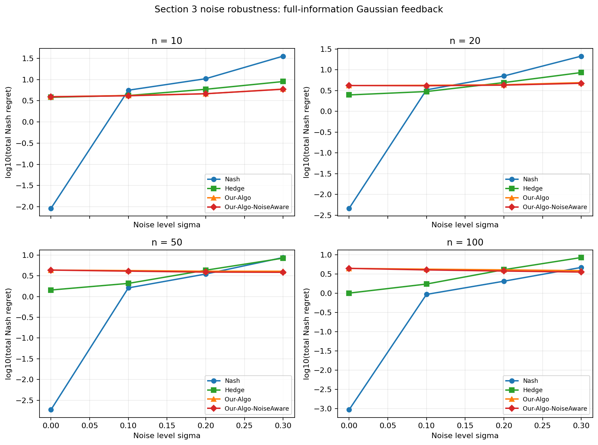
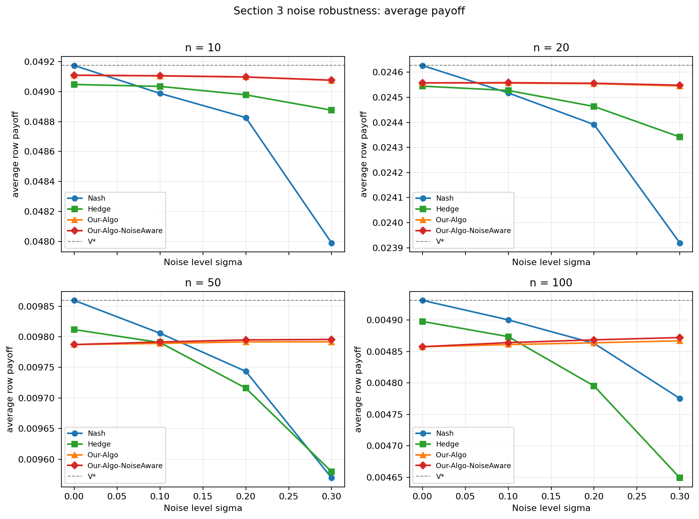
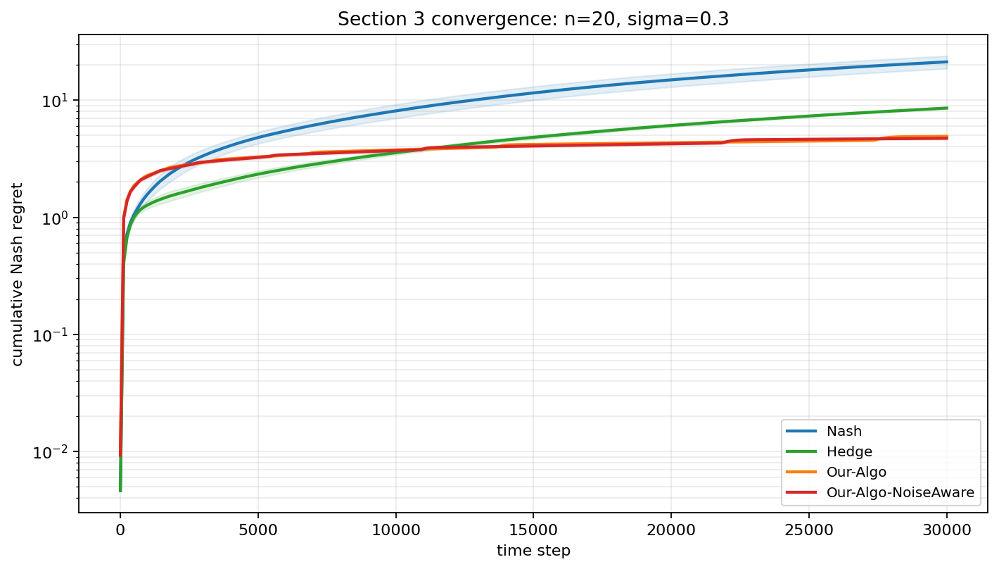
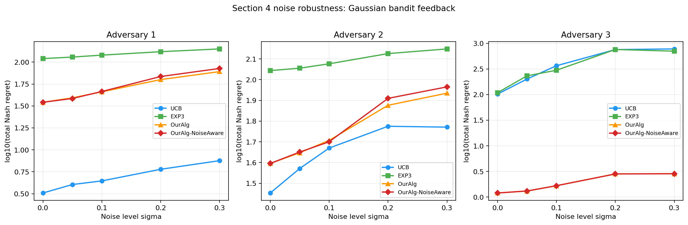
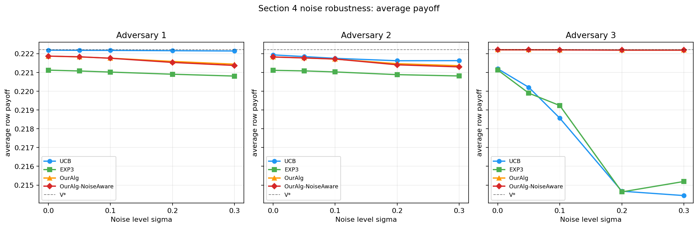
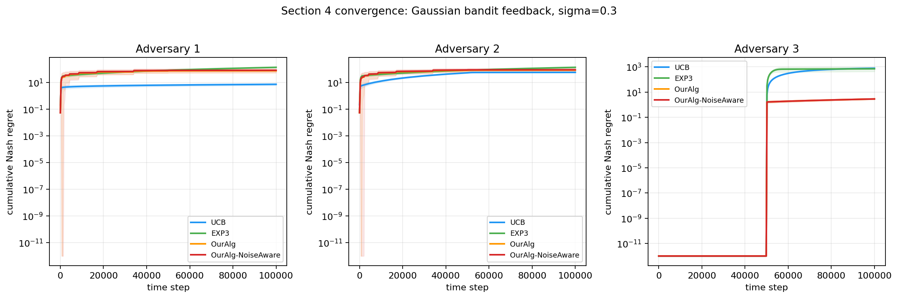

# Zero-Sum Matrix Games: Paper Reproduction

Reproduction of the experimental setup from *On the Limitations and Possibilities of Nash Regret Minimization in Zero-Sum Matrix Games under Noisy Feedback* (arXiv:2306.13233v3).

- Section 3 (full-information feedback): `Full_information_feedback/`
- Section 4 (bandit feedback, 2x2): `Bandit_feedback/`

---

# Full-information feedback (Section 3) reproduction

## Install

```bash
cd Full_information_feedback
pip install -r requirements.txt
```

## Setting

`n x n` diagonal matrix game with `A[i,i] = 0.4 + 0.2*(i-1)/(n-1)`. Each round the row player sees the **full noisy payoff row** (full-information feedback) and the column player always plays best-response. Plots show `log(total Nash regret)` vs `log(T)` for Our-Algo, Nash-empirical baseline, and Hedge, across `n = 10, 20, 50, 100`. The claim: Our-Algo achieves `polylog(T)` Nash regret while Hedge grows as `sqrt(T)`.

## Section 3 plots

The four plots below were generated with `Full_information_feedback/experiments_section3.py` using the `paper-lite` preset and the `official` variant for `n_actions = 10, 20, 50, 100`.

At **n=10**, Our-Algo grows much slower than Nash and Hedge.


At **n=20**, the same qualitative behavior holds: the proposed method has a flatter regret curve than the baselines.


At **n=50**, the proposed method continues to outperform the baselines across horizons.


At **n=100**, the gap vs Nash/Hedge is still visible under the same experimental protocol.


## Empirical vs theoretical

On log-log axes, a `sqrt(T)` regret rate shows up as a straight line with slope `0.5`, while a `polylog(T)` rate appears as a curve that *flattens* toward slope `0` as `T` grows. The paper's theoretical rates for this setting are:

- **Our-Algo:** `polylog(T)` (with an extra dependence on `n`).
- **Hedge:** `O(sqrt(T log n))`, the standard online learning bound.
- **Nash (empirical):** `O(sqrt(T))`, a baseline that plays Nash of the empirical matrix.

The four plots above match this: Hedge and Nash trace approximately straight lines with slope near `0.5`, while Our-Algo's curve visibly flattens across horizons, consistent with the `polylog(T)` rate. The `n`-dependence predicted by the theory is also visible, since the gap between Our-Algo and the baselines shrinks as `n` grows from 10 to 100, though Our-Algo still stays clearly below `sqrt(T)` behavior.

---

# Bandit feedback (Section 4) reproduction

## Install

```bash
cd Bandit_feedback
pip install numpy matplotlib pandas jupyter
```

## Setting

2x2 diagonal matrix game `A = [[2/3, 0], [0, 1/3]]` with Nash equilibrium `x* = y* = (1/3, 2/3)` and value `V* = 2/9`. Each round the row player observes **only the Bernoulli-sampled entry `A[i_t, j_t]`** at the played cell (bandit feedback), not the full row. Every trial runs in two phases of length `T/2`: Phase 1 uses a phase-specific adversary, Phase 2 always uses pure best-response. Our-Algo (Algorithm 6) is compared against UCB and EXP3 against three column adversaries:

- **Adversary 1 (threshold BR):** plays pure best-response the moment `x1` deviates from `1/3`.
- **Adversary 2 (tolerance BR):** same as Adversary 1 but with a `±1/sqrt(T)` tolerance band around Nash before punishing.
- **Adversary 3 (Nash -> BR):** plays Nash `y* = (1/3, 2/3)` during Phase 1, then switches to pure best-response in Phase 2.

The plot shows `log(total Nash regret)` vs `log(T)` for each adversary. The claim: Our-Algo achieves `polylog(T)` Nash regret against **all three** adversaries.

## Figure 2 reproduction (paper Section 4.1)

The figure below was reproduced with `Bandit_feedback/section4_reproduction.ipynb`. The same experiment is also available in `Bandit_feedback/section4_bandit.py`.

Across all three adversaries, Our-Algo stays essentially flat while UCB and EXP3 grow polynomially, most dramatically against Adversary 3, matching the paper's core claim.


## Empirical vs theoretical

The paper's theoretical rates for the `2x2` bandit setting are:

- **Our-Algo (Algorithm 6):** `polylog(T)` Nash regret against any column adversary.
- **UCB and EXP3:** both are `Omega(sqrt(T))` in this adversarial regime. UCB fails because it is built for stochastic, not adversarial, columns; EXP3 fails because of the general lower bound in the paper's Theorem 3.

On log-log axes this means Our-Algo should have a slope that flattens toward `0`, while UCB and EXP3 should sit on straight lines with slope near `0.5`. Figure 2 matches this prediction: Our-Algo's curve is essentially flat against all three adversaries (most visibly against Adversary 3), while UCB and EXP3 grow at roughly `sqrt(T)` rate. The empirical results therefore align with the theoretical regret bounds claimed in Section 4.

---

# Extension: Noise Robustness

## Motivation

The original reproduction studies the paper's algorithms under the feedback models used in the paper. This extension asks a complementary question: if the feedback becomes noisier, can the proposed method be made explicitly noise-aware?

The experiment varies a Gaussian noise parameter `sigma` and measures both total Nash regret and average row payoff. The noisy feedback is generated as `clip(A + sigma * N(0,1), 0, 1)`. Section 3 uses full-information feedback, so the learner observes a full noisy matrix signal each round. Section 4 uses bandit feedback, so the learner observes only the noisy reward at the played cell.

The extension uses two complementary plot styles:

- **Noise-sensitivity plots:** final regret and average payoff as `sigma` increases.
- **Convergence plots:** cumulative Nash regret over time at a representative high-noise setting, `sigma = 0.3`.

The extension is implemented in:

- `Extensions/Extension_Noise_Robustness_Full_info_feedback/`
- `Extensions/Extension_Noise_Robustness_Bandit_feedback/`

The plots below were generated from:

- `Extensions/Extension_Noise_Robustness_Full_info_feedback/section3_noise_robustness.ipynb` with the `medium` preset.
- `Extensions/Extension_Noise_Robustness_Bandit_feedback/section4_noise_robustness.ipynb` with the `paper-lite` preset.

## Algorithmic change

The baselines are kept unchanged. The extension only modifies the paper's proposed method, adding a second variant that is compared directly against the original algorithm.

In Section 3, the original Our-Algo uses the update threshold:

```python
threshold = min(log(T)**2, sqrt(T))
```

The noise-aware version uses:

```python
threshold = min((1 + 2*sigma) * log(T)**2, sqrt(T))
```

The intuition is that, under noisier full-information feedback, the algorithm should wait longer before trusting the empirical matrix estimate. This Section 3 variant scales with the Gaussian standard deviation `sigma`, making the delay stronger as feedback becomes noisier.

In Section 4, the original bandit algorithm uses the confidence radius:

```python
devs = sqrt(log_c / (count + 1))
```

The noise-aware version uses:

```python
devs = (1 + sigma**2) * sqrt(log_c / (count + 1))
```

Here the idea is to widen the confidence radius mildly when feedback noise increases. The factor uses `sigma**2` rather than `sigma` because Gaussian noise variance scales with `sigma**2`; this keeps the modification conservative and avoids over-widening the confidence set.

## Section 3 results

<table>
  <tr>
    <td width="50%"></td>
    <td width="50%"></td>
  </tr>
  <tr>
    <td align="center"><b>Section 3: Nash regret vs noise</b></td>
    <td align="center"><b>Section 3: Average payoff vs noise</b></td>
  </tr>
</table>

The regret plot shows that increasing `sigma` mainly hurts the Nash and Hedge baselines. The two proposed-method curves are close, so the direct comparison is easier to read from the table below. The payoff plot confirms that the noise-aware change does not damage average payoff; both Our-Algo variants stay close to the game value across all tested noise levels.

At the highest tested noise level, `sigma = 0.3`, the noise-aware version improves the original Our-Algo consistently:

| n | Nash regret | Hedge regret | Our-Algo regret | Our-Algo-NoiseAware regret | Reduction vs Our-Algo |
|---:|---:|---:|---:|---:|---:|
| 10 | 35.56 | 8.96 | 5.96 | 5.90 | 0.9% |
| 20 | 21.26 | 8.57 | 4.91 | 4.73 | 3.6% |
| 50 | 8.71 | 8.41 | 4.07 | 3.84 | 5.8% |
| 100 | 4.68 | 8.46 | 3.85 | 3.55 | 8.0% |

The improvement is moderate rather than dramatic, but it is consistent across all tested matrix sizes and becomes more visible for larger games. This supports the idea that, in the full-information setting, waiting longer before updating can improve robustness when empirical estimates are noisy.

<p align="center"><b>Section 3: Convergence under high noise</b></p>



The convergence plot fixes `n = 20` and `sigma = 0.3`, then tracks cumulative Nash regret over time. The two Our-Algo curves remain close because the original method is already robust, but the noise-aware version ends with slightly lower regret, matching the table above.

## Section 4 results

<p align="center"><b>Section 4: Nash regret vs noise</b></p>



<p align="center"><b>Section 4: Average payoff vs noise</b></p>



For Section 4, the same noise-aware idea does not improve the original OurAlg overall. The high-noise comparison at `sigma = 0.3` is:

| Adversary | UCB regret | EXP3 regret | OurAlg regret | OurAlg-NoiseAware regret | Change vs OurAlg |
|---:|---:|---:|---:|---:|---:|
| 1 | 7.53 | 141.27 | 77.90 | 84.64 | +8.7% |
| 2 | 59.01 | 140.74 | 86.07 | 92.29 | +7.2% |
| 3 | 778.26 | 703.05 | 2.86 | 2.86 | +0.0% |

Positive values in the last column mean that the noise-aware variant has higher regret than the original method. This is informative: in the bandit setting, the original algorithm already contains uncertainty handling through optimistic estimates and confidence radii. Increasing the radius further makes the algorithm slightly too conservative against Adversaries 1 and 2, where it needs to react accurately to best-response-style behavior. Against Adversary 3, both versions remain very stable and stay close to the game value `V* = 2/9`.

<p align="center"><b>Section 4: Convergence under high noise</b></p>



The convergence plot fixes `sigma = 0.3` and shows one panel for each adversary. It confirms the same interpretation as the table: OurAlg remains very stable, especially against Adversary 3, while the noise-aware version does not improve the original method in the bandit setting.

## Extension conclusion

The extension shows two different outcomes from the same noise-aware idea.

In Section 3, noise-aware adaptation improves the proposed method consistently under high Gaussian feedback noise. The improvement is moderate, but it appears across all tested matrix sizes and does not reduce average payoff.

In Section 4, the original proposed method is already robust to bandit uncertainty. The attempted noise-aware confidence widening does not improve it, which suggests that the bandit algorithm from the paper is already carefully calibrated for uncertainty and that adding extra conservatism can hurt.
