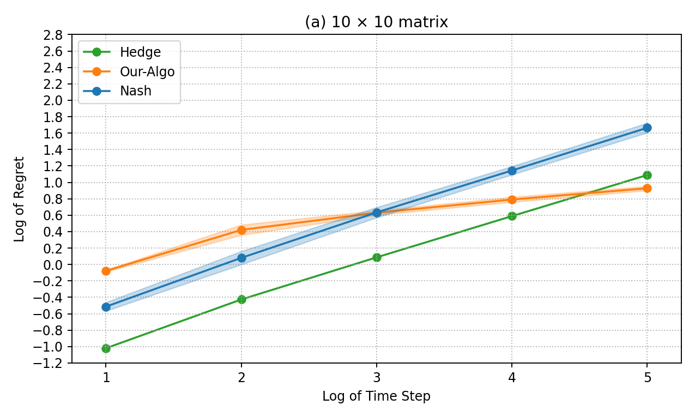
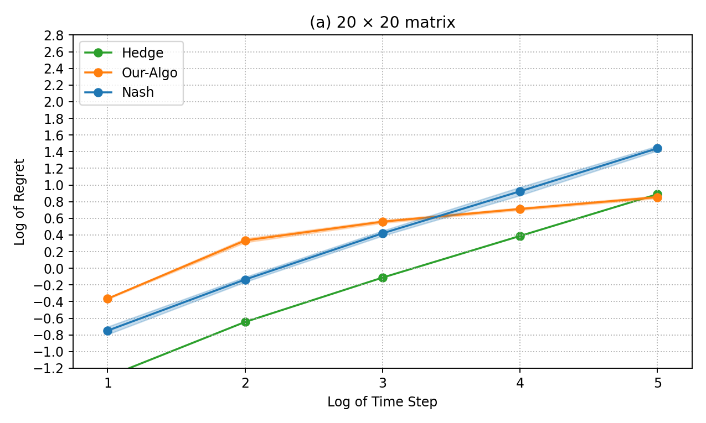
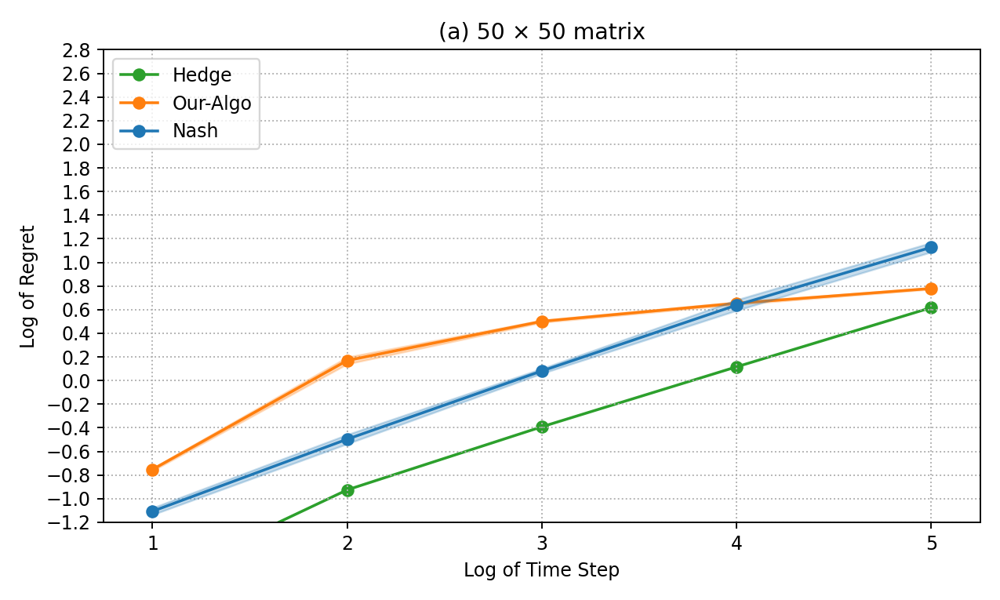
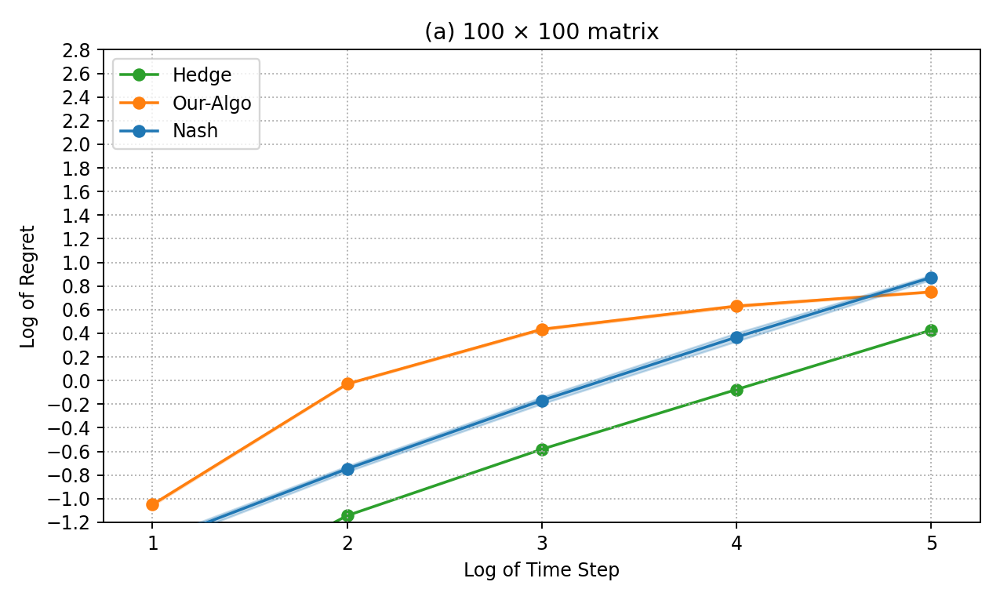
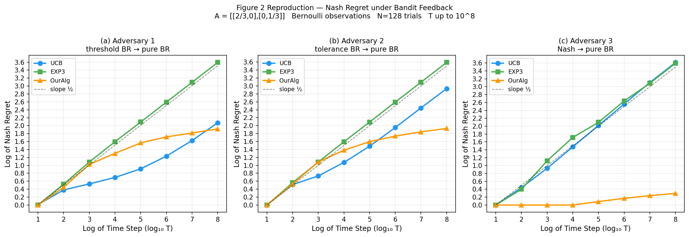

# Zero-Sum Matrix Games — Paper Reproduction

Reproduction of the experimental setup from *On the Limitations and Possibilities of Nash Regret Minimization in Zero-Sum Matrix Games under Noisy Feedback* (arXiv:2306.13233v3).

- Section 3 (full-information feedback): `Full_information_feedback/`
- Section 4 (bandit feedback, 2x2): `Bandit_feedback/`

---

# Full-information feedback (Section 3) reproduction

## Install

```bash
cd Full_information_feedback
pip install -r requirements.txt
```

## Setting

`n x n` diagonal matrix game with `A[i,i] = 0.4 + 0.2*(i-1)/(n-1)`. Each round the row player sees the **full noisy payoff row** (full-information feedback) and the column player always plays best-response. Plots show `log(total Nash regret)` vs `log(T)` for Our-Algo, Nash-empirical baseline, and Hedge, across `n = 10, 20, 50, 100`. The claim: Our-Algo achieves `polylog(T)` Nash regret while Hedge grows as `sqrt(T)`.

## Reproduce the 4 plots (paper-lite, official)

```bash
cd Full_information_feedback
python experiments_section3.py --preset paper-lite --variant official --n_actions 10
```

At **n=10**, Our-Algo grows much slower than Nash and Hedge.



```bash
cd Full_information_feedback
python experiments_section3.py --preset paper-lite --variant official --n_actions 20
```

At **n=20**, the same qualitative behavior holds: the proposed method has a flatter regret curve than the baselines.



```bash
cd Full_information_feedback
python experiments_section3.py --preset paper-lite --variant official --n_actions 50
```

At **n=50**, the proposed method continues to outperform the baselines across horizons.



```bash
cd Full_information_feedback
python experiments_section3.py --preset paper-lite --variant official --n_actions 100
```

At **n=100**, the gap vs Nash/Hedge is still visible under the same experimental protocol.



## Empirical vs theoretical

On log-log axes, a `sqrt(T)` regret rate shows up as a straight line with slope `0.5`, while a `polylog(T)` rate appears as a curve that *flattens* toward slope `0` as `T` grows. The paper's theoretical rates for this setting are:

- **Our-Algo:** `polylog(T)` (with an extra dependence on `n`).
- **Hedge:** `O(sqrt(T log n))` — standard online learning bound.
- **Nash (empirical):** `O(sqrt(T))` — baseline that plays Nash of the empirical matrix.

The four plots above match this: Hedge and Nash trace approximately straight lines with slope near `0.5`, while Our-Algo's curve visibly flattens across horizons, consistent with the `polylog(T)` rate. The `n`-dependence predicted by the theory is also visible — the gap between Our-Algo and the baselines shrinks as `n` grows from 10 to 100, though Our-Algo still stays clearly below `sqrt(T)` behavior.

---

# Bandit feedback (Section 4) reproduction

## Install

```bash
cd Bandit_feedback
pip install numpy matplotlib pandas jupyter
```

## Setting

2x2 diagonal matrix game `A = [[2/3, 0], [0, 1/3]]` with Nash equilibrium `x* = y* = (1/3, 2/3)` and value `V* = 2/9`. Each round the row player observes **only the Bernoulli-sampled entry `A[i_t, j_t]`** at the played cell (bandit feedback), not the full row. Every trial runs in two phases of length `T/2`: Phase 1 uses a phase-specific adversary, Phase 2 always uses pure best-response. Our-Algo (Algorithm 6) is compared against UCB and EXP3 against three column adversaries:

- **Adversary 1 (threshold BR):** plays pure best-response the moment `x1` deviates from `1/3`.
- **Adversary 2 (tolerance BR):** same as Adversary 1 but with a `±1/sqrt(T)` tolerance band around Nash before punishing.
- **Adversary 3 (Nash -> BR):** plays Nash `y* = (1/3, 2/3)` during Phase 1, then switches to pure best-response in Phase 2.

The plot shows `log(total Nash regret)` vs `log(T)` for each adversary. The claim: Our-Algo achieves `polylog(T)` Nash regret against **all three** adversaries.

## Reproduce Figure 2 (paper Section 4.1)

```bash
cd Bandit_feedback
jupyter notebook section4_reproduction.ipynb
```

Run all cells top-to-bottom. The standalone script `section4_bandit.py` runs the same pipeline from the command line:

```bash
cd Bandit_feedback
python section4_bandit.py
```

Across all three adversaries, Our-Algo stays essentially flat while UCB and EXP3 grow polynomially — most dramatically against Adversary 3, matching the paper's core claim.



## Empirical vs theoretical

The paper's theoretical rates for the `2x2` bandit setting are:

- **Our-Algo (Algorithm 6):** `polylog(T)` Nash regret against any column adversary.
- **UCB and EXP3:** both are `Omega(sqrt(T))` in this adversarial regime — UCB because it is built for stochastic, not adversarial, columns; EXP3 because of the general lower bound in the paper's Theorem 3.

On log-log axes this means Our-Algo should have a slope that flattens toward `0`, while UCB and EXP3 should sit on straight lines with slope near `0.5`. Figure 2 matches this prediction: Our-Algo's curve is essentially flat against all three adversaries — most visibly against Adversary 3 — while UCB and EXP3 grow at roughly `sqrt(T)` rate. The empirical results therefore align with the theoretical regret bounds claimed in Section 4.
