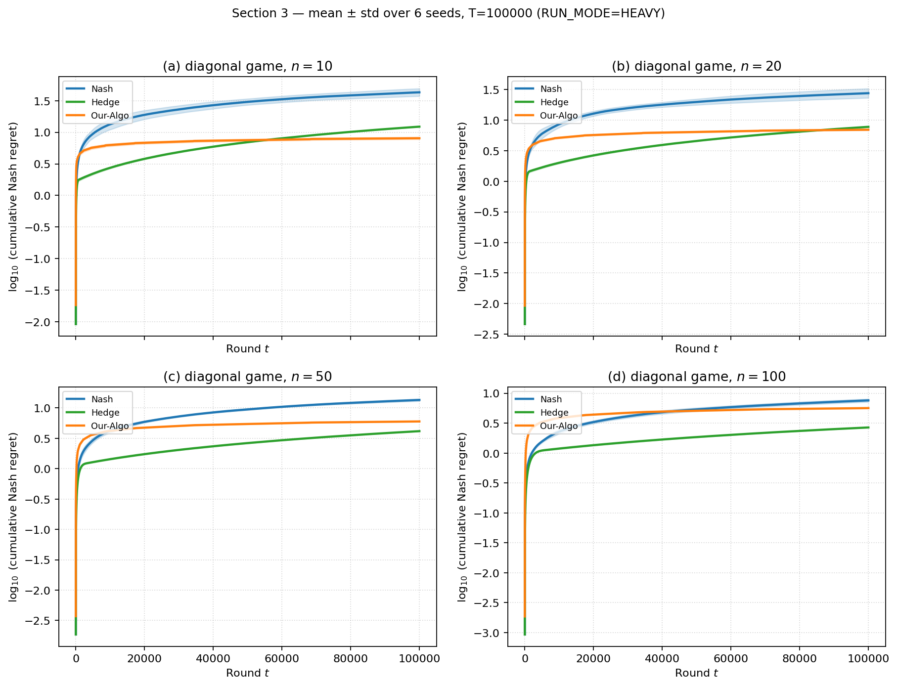
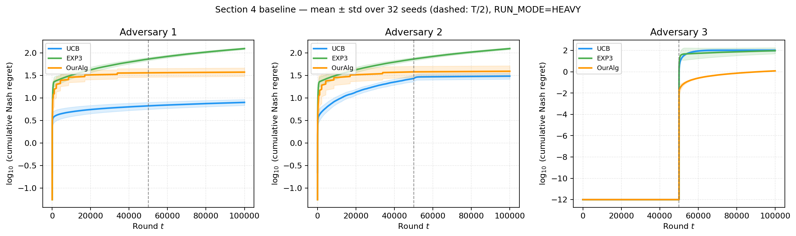
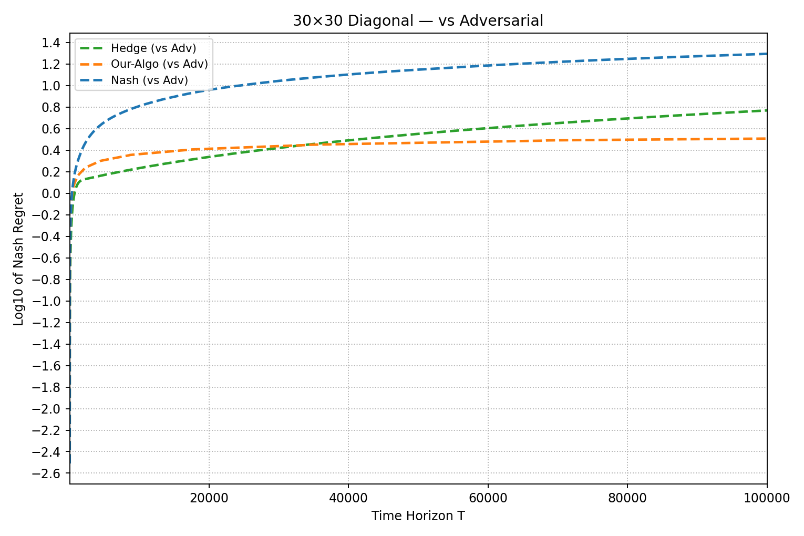
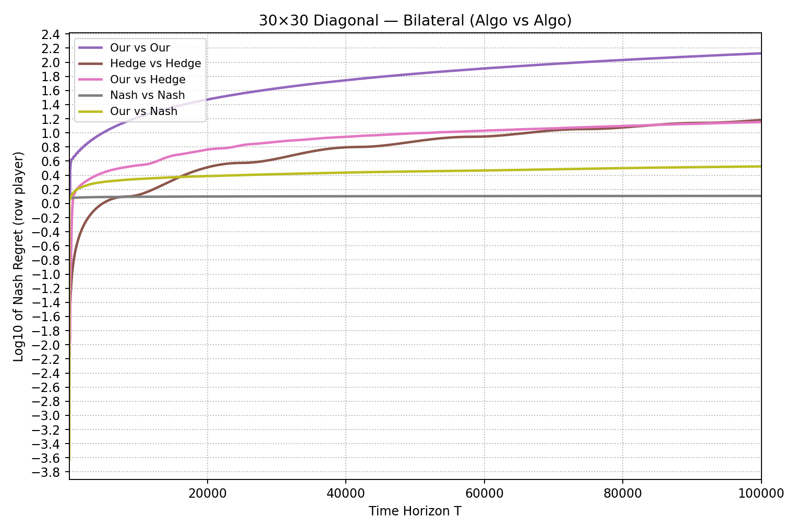
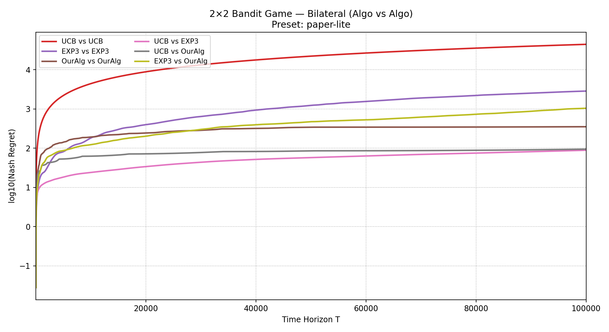
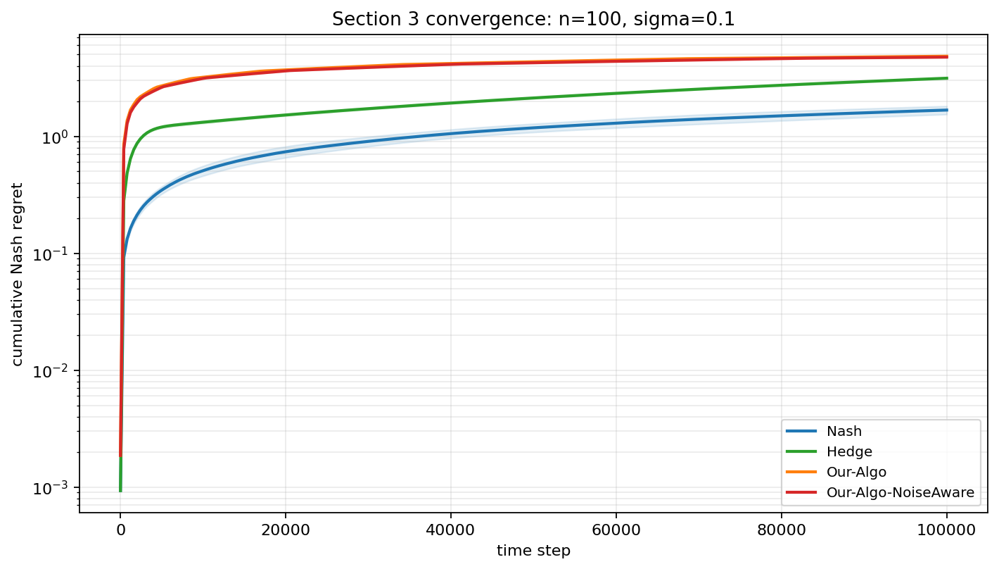
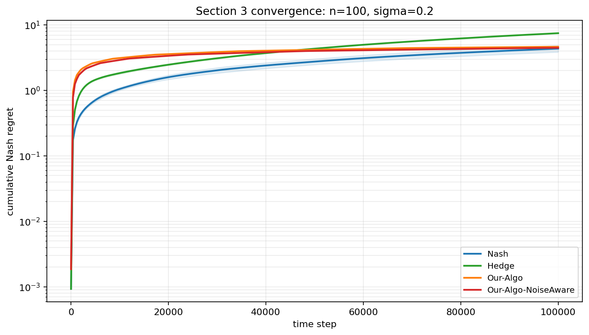
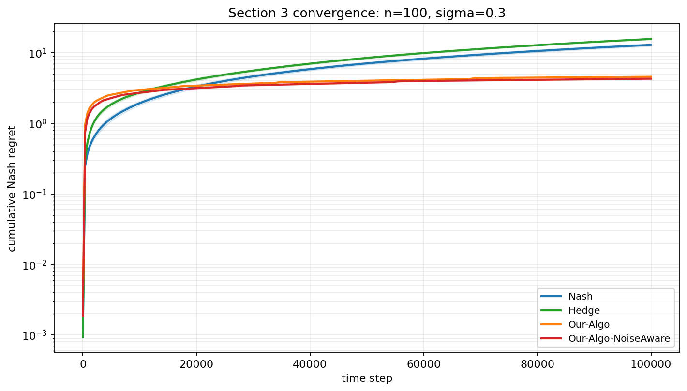
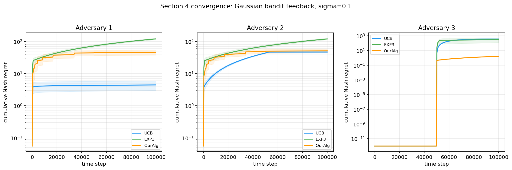
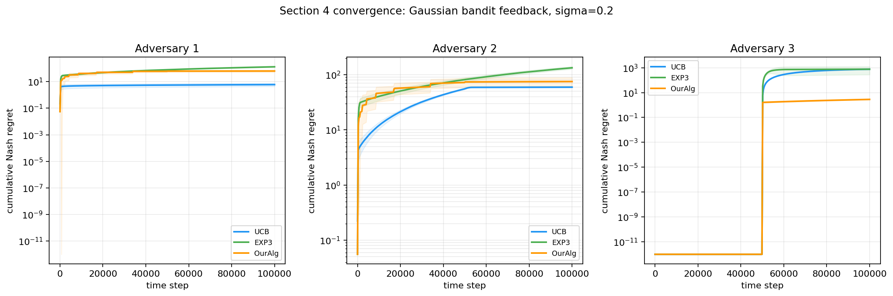

# Zero-Sum Matrix Games: Paper Reproduction

Reproduction of the experimental setup from *On the Limitations and Possibilities of Nash Regret Minimization in Zero-Sum Matrix Games under Noisy Feedback* (arXiv:2306.13233v3).

- Section 3 (full-information feedback): `Full_information_feedback/`
- Section 4 (bandit feedback, 2x2): `Bandit_feedback/`

**Extensions (below the reproductions):** bilateral learning (both players adapt), noise-robustness experiments under `Extensions/`, and bandit Nash regret **beyond 2×2** (empirical port to larger diagonal games).

---

# Full-information feedback (Section 3) reproduction

## Install

```bash
cd Full_information_feedback
pip install -r requirements.txt
```

## Setting

`n x n` diagonal matrix game with `A[i,i] = 0.4 + 0.2*(i-1)/(n-1)`. Each round the row player sees the **full noisy payoff row** (full-information feedback) and the column player always plays best-response. Plots show `log(total Nash regret)` vs `log(T)` for Our-Algo, Nash-empirical baseline, and Hedge, across `n = 10, 20, 50, 100`. The claim: Our-Algo achieves `polylog(T)` Nash regret while Hedge grows as `sqrt(T)`.

## Section 3 plots

**Nash regret cumulative curves:** [`Full_information_feedback/Nash_regret_curve_section3/section3_nashregret_curves.ipynb`](Full_information_feedback/Nash_regret_curve_section3/section3_nashregret_curves.ipynb) — **2×2 panels** ($n \in \{10,20,50,100\}$): $\log_{10}$ cumulative Nash regret vs round $t$ for Nash, Hedge, and Our-Algo. The plot below was generated with `RUN_MODE=HEAVY` (`T=100000`, 6 seeds).



The cumulative trajectories show the same qualitative trend as the terminal-regret reproduction while exposing the time evolution directly. For `n=10` and `n=20`, Our-Algo rises early and then flattens, while Nash keeps the steepest long-run growth and Hedge continues to accumulate regret more steadily. For `n=50` and `n=100`, the curves move closer together and the finite-horizon ordering becomes less uniform: Hedge is competitive, Nash remains high, and Our-Algo stays relatively flat after its initial exploration cost. This is consistent with the stronger `n`-dependence in the full-information theory and with the official Section 3 regret accounting used for Our-Algo.

The four paper-style terminal-regret plots below were generated with `Full_information_feedback/experiments_section3.py` using the `paper-lite` preset and the `official` variant for `n_actions = 10, 20, 50, 100`.

<table>
  <tr>
    <td width="50%"></td>
    <td width="50%"></td>
  </tr>
  <tr>
    <td align="center"><b>n = 10</b></td>
    <td align="center"><b>n = 20</b></td>
  </tr>
  <tr>
    <td width="50%"></td>
    <td width="50%"></td>
  </tr>
  <tr>
    <td align="center"><b>n = 50</b></td>
    <td align="center"><b>n = 100</b></td>
  </tr>
</table>

In the paper-style terminal-regret plots, `n=10` shows Our-Algo growing much slower than Nash and Hedge. The same qualitative behavior holds at `n=20`, where the proposed method has a flatter regret curve than the baselines. At `n=50` and `n=100`, the gap shrinks as the matrix size grows, matching the stronger dimension dependence in the theory.

## Empirical vs theoretical

On log-log axes, a `sqrt(T)` regret rate shows up as a straight line with slope `0.5`, while a `polylog(T)` rate appears as a curve that *flattens* toward slope `0` as `T` grows. The paper's theoretical rates for this setting are:

- **Our-Algo:** `polylog(T)` (with an extra dependence on `n`).
- **Hedge:** `O(sqrt(T log n))`, the standard online learning bound.
- **Nash (empirical):** `O(sqrt(T))`, a baseline that plays Nash of the empirical matrix.

The paper-style terminal-regret plots match this: Hedge and Nash trace approximately straight lines with slope near `0.5`, while Our-Algo's curve visibly flattens across horizons, consistent with the `polylog(T)` rate. The cumulative curves above show the same story over time rather than only at terminal horizons, with the methods becoming harder to separate as `n` grows.

---

# Bandit feedback (Section 4) reproduction

## Install

```bash
cd Bandit_feedback
pip install numpy matplotlib pandas jupyter
```

## Setting

2x2 diagonal matrix game `A = [[2/3, 0], [0, 1/3]]` with Nash equilibrium `x* = y* = (1/3, 2/3)` and value `V* = 2/9`. Each round the row player observes **only the Bernoulli-sampled entry `A[i_t, j_t]`** at the played cell (bandit feedback), not the full row. Every trial runs in two phases of length `T/2`: Phase 1 uses a phase-specific adversary, Phase 2 always uses pure best-response. Our-Algo (Algorithm 6) is compared against UCB and EXP3 against three column adversaries:

- **Adversary 1 (threshold BR):** plays pure best-response the moment `x1` deviates from `1/3`.
- **Adversary 2 (tolerance BR):** same as Adversary 1 but with a `±1/sqrt(T)` tolerance band around Nash before punishing.
- **Adversary 3 (Nash -> BR):** plays Nash `y* = (1/3, 2/3)` during Phase 1, then switches to pure best-response in Phase 2.

The plot shows `log(total Nash regret)` vs `log(T)` for each adversary. The claim: Our-Algo achieves `polylog(T)` Nash regret against **all three** adversaries.

## Figure 2 reproduction (paper Section 4.1)

The original Figure 2 below was reproduced with `Bandit_feedback/section4_reproduction.ipynb`. The same experiment is also available in `Bandit_feedback/section4_bandit.py`.

**Nash regret cumulative curves:** [`Bandit_feedback/Nash_regret_curve_section4/section4_nashregret_curves.ipynb`](Bandit_feedback/Nash_regret_curve_section4/section4_nashregret_curves.ipynb) — **three panels** (adversaries 1–3): $\log_{10}$ cumulative Nash regret vs round $t$ for UCB, EXP3, and OurAlg; the dashed vertical line marks the phase switch at $T/2$. The plot below was generated with `RUN_MODE=HEAVY` (`T=100000`, 32 seeds).



The cumulative trajectories make the two-phase structure visible. Against Adversary 1, UCB stays lowest, OurAlg plateaus at a moderate level after its initial exploration, and EXP3 keeps growing. Against Adversary 2, UCB and OurAlg both flatten after the first part of the run while EXP3 remains the highest-regret baseline. Against Adversary 3, all methods have negligible regret in Phase 1 because the column plays Nash, then the $T/2$ switch sharply separates the methods: UCB and EXP3 jump to much larger regret, while OurAlg stays far lower and grows slowly. This is the clearest cumulative-curve version of the Section 4 claim.

The robustness claim is clearest in the phase-switch setting, most dramatically against Adversary 3, where OurAlg remains far below the generic bandit baselines after the adversary changes behavior.


## Empirical vs theoretical

The paper's theoretical rates for the `2x2` bandit setting are:

- **Our-Algo (Algorithm 6):** `polylog(T)` Nash regret against any column adversary.
- **UCB and EXP3:** both are `Omega(sqrt(T))` in this adversarial regime. UCB fails because it is built for stochastic, not adversarial, columns; EXP3 fails because of the general lower bound in the paper's Theorem 3.

On log-log axes this means Our-Algo should have a slope that flattens toward `0`, while UCB and EXP3 should sit on straight lines with slope near `0.5`. Figure 2 matches this prediction: Our-Algo's curve is essentially flat against all three adversaries (most visibly against Adversary 3), while UCB and EXP3 grow at roughly `sqrt(T)` rate. The empirical results therefore align with the theoretical regret bounds claimed in Section 4.

---

# Extension: Bilateral learning

In the **paper reproduction** above, the **column player follows a fixed rule** (pure best-response to the row mix). This extension studies **bilateral learning**: **both** players adapt from feedback while playing the same diagonal games.

- **Section 3 (full information):** Each round both players see **Bernoulli samples** on the diagonal (same observation model as `run_official_diag_algo`). We plot the original one-sided row-vs-adversarial-column reference separately from the bilateral learner-pair curves.
- **Section 4 (2×2 bandit):** Both players use bandit feedback rules on the same matrix game as the reproduction. The figure below focuses only on bilateral learner pairs (UCB vs UCB, EXP3 vs EXP3, OurAlg vs OurAlg, and mixed pairings).

Code:

- `Full_information_feedback/section3_bilateral.py`
- `Bandit_feedback/section4_bilateral.py` (imports `Bandit_feedback/section4_bandit.py` for `A`, `V*`, and adversarial runs)

## Section 3 — diagonal game, adversarial and bilateral curves

### Install

```bash
cd Full_information_feedback
pip install -r requirements.txt
```

### How to run

Example:

```bash
python section3_bilateral.py --preset paper-lite --n_actions 30
```

Optional: `--variant` (`official`, `subroutine`, `theory-lp`) and `--preset` (`quick`, `medium`, `paper-lite`, …); defaults match `parse_args` in the script.

### Paper-lite curves (`n = 30`)

The current script writes the adversarial reference and bilateral learner curves as separate figures. Both use **log(total Nash regret)** vs **time horizon `T`** on linear `T`.

<table>
  <tr>
    <td width="50%"></td>
    <td width="50%"></td>
  </tr>
  <tr>
    <td align="center"><b>Adversarial-column reference</b></td>
    <td align="center"><b>Bilateral learner pairs</b></td>
  </tr>
</table>

The adversarial-column reference recovers the original one-sided comparison: Nash grows fastest, Hedge grows steadily, and Our-Algo flattens after its early exploration phase. In the bilateral plot, the opponent is no longer an immediate best response, so the curves answer a different question. **Our vs Our** has the largest cumulative Nash-regret growth in this run, while **Nash vs Nash** stays nearly flat because both sides remain close to the equilibrium-like fixed strategy. Mixed pairs such as **Our vs Nash** and **Our vs Hedge** sit between these extremes, showing how the row learner’s regret changes when the column side also follows a learning rule instead of the paper’s adversarial response.

## Section 4 — 2×2 bandit: bilateral learners

### Install

```bash
cd Bandit_feedback
pip install -r requirements.txt
```

(`numpy`, `matplotlib`, `scipy` — enough for `section4_bilateral.py`. The notebook reproduction earlier in this README uses additional packages per its install block.)

### How to run

```bash
python section4_bilateral.py --preset paper-lite
```

The figure is saved under `plots_bilateral_bandit/` as `section4_bilateral_paper-lite.png`.

### Figures

The generated figure focuses on **bilateral bandit learner pairs** only. Both players use bandit feedback rules on the same $2\times2$ game as Section 4, and the plot reports `log10(Nash Regret)` over the time horizon.

<table>
  <tr>
    <td align="center"><b>`paper-lite` preset</b><br></td>
  </tr>
</table>

**Reading the plot:** The ranking is driven by the paired learning dynamics, not by the paper’s adversarial-column protocol. **UCB vs UCB** grows the most, **EXP3 vs EXP3** is also high, and **OurAlg vs OurAlg** plateaus below those two symmetric generic-bandit pairings. Mixed pairs occupy intermediate regimes: **UCB vs EXP3** is among the lower curves, while **EXP3 vs OurAlg** continues to grow more steadily. These results should not be compared directly to the Section 4 reproduction claim, because here both players adapt rather than fixing the column adversary.

## Extension conclusion (bilateral)

- **Section 3:** Separates the **paper-style row-vs-best-response** reference curves from the **fully bilateral** diagonal-game learning curves at `n = 30`.
- **Section 4:** Shows **bilateral bandit** learning curves only, on the same $2\times 2$ game as Section 4 of the README.

---

# Extension: Noise Robustness

We inject **Gaussian noise** into the feedback (entries clipped to `[0, 1]`): `clip(A + sigma * N(0,1), 0, 1)`. Section 3 keeps **full-matrix** observations each round; Section 4 keeps **bandit** observations (noisy reward only at the played cell).

Code and notebooks:

- `Extensions/Extension_Noise_Robustness_Full_info_feedback/section3_noise_robustness.py` and `section3_noise_robustness.ipynb`
- `Extensions/Extension_Noise_Robustness_Bandit_feedback/section4_noise_robustness.py` and `section4_noise_robustness.ipynb`

Figures below use the **`paper-lite`** preset (`T = 100_000` for both Section 3 and Section 4 convergence), multi-sigma convergence runs at **`sigma` ∈ {0.1, 0.2, 0.3}**, and seed **`7`** (Section 3) / **`42`** (Section 4) unless you change them in the notebooks.

## Section 3 — noise-aware threshold (full information)

Baselines are unchanged. We add **Our-Algo-NoiseAware**, which waits longer before switching out of the exploration phase when feedback is noisier:

```python
threshold = min((1 + 2 * sigma) * log(T)**2, sqrt(T))
```

compared to the original `threshold = min(log(T)**2, sqrt(T))`.

### Summary at `sigma = 0.3` (noise sweep, `paper-lite`)

| n | Nash regret | Hedge regret | Our-Algo regret | Our-Algo-NoiseAware regret | Reduction vs Our-Algo |
|---:|---:|---:|---:|---:|---:|
| 10 | 113.08 | 16.30 | 8.54 | 8.25 | 3.4% |
| 20 | 58.66 | 15.48 | 6.36 | 6.08 | 4.4% |
| 50 | 24.41 | 15.33 | 5.02 | 4.78 | 4.8% |
| 100 | 12.99 | 15.75 | 4.58 | 4.30 | 6.1% |

### Convergence (`n = 100`)

**Setup:** Each plot is **cumulative Nash regret** (log scale) vs time for Nash, Hedge, Our-Algo, and Our-Algo-NoiseAware under **diagonal full-information Gaussian noise** at noise standard deviation σ (**σ = 0.1**, then **0.2**, then **0.3** below). **Assumption:** curves are means over repeated runs (shaded bands).

<table>
  <tr>
    <td align="center"><b>σ = 0.1</b><br></td>
  </tr>
  <tr>
    <td align="center"><b>σ = 0.2</b><br></td>
  </tr>
  <tr>
    <td align="center"><b>σ = 0.3</b><br></td>
  </tr>
</table>

As σ increases, Nash and Hedge deteriorate because they rely on noisy empirical summaries without the paper’s exploration–commit schedule. At `n=100`, low noise still favors Nash in terminal cumulative regret, but Our-Algo and Our-Algo-NoiseAware become much more stable as σ grows. By σ = 0.3, the two Our-Algo variants flatten while Nash and Hedge keep rising, and the noise-aware threshold finishes lowest. Scaling the delay with σ therefore matters most in the noisier regime, where it avoids committing too early to a matrix estimate distorted by Gaussian feedback.

## Section 4 — bandit noise (UCB, EXP3, OurAlg)

**Relationship to the Section 4 reproduction (Figure 2, earlier in this README):**

- **Same game:** the `2×2` matrix `A`, Nash value `V*`, and **two phases of `T/2` rounds** each (Phase 1: adversary-specific column play; Phase 2: **pure best-response** for every adversary type—so a **jump near `T / 2`** is structural, not an artifact of the extension).
- **Same three adversaries:** they are the **same column-player rules** as in **`Bandit_feedback/section4_bandit.py`**—implemented via the same **`advnew_batch` / `adv22gd_batch`** logic as the baseline runs (**Adversary 1** threshold best-response, **Adversary 2** tolerance band, **Adversary 3** fixed Nash mix $(1/3,\,2/3)$ in Phase 1). The extension lives in `Extensions/Extension_Noise_Robustness_Bandit_feedback/` but **imports that module**; we do **not** introduce new opponents.
- **Only the observation model changes:** in the reproduction above, each round observes a **Bernoulli** outcome at the played cell (probability `A[i,j]`). Here we observe **`clip(A[i,j] + sigma * N(0,1), 0, 1)`** at the played cell (Gaussian noise, then clip). Because feedback is noisier and biased when clipped, **regret curves need not match Figure 2** in ordering or magnitude; differences are **expected** and do **not** contradict the noiseless experiment—they answer a different question (“what if bandit feedback is Gaussian-noisy?”).

We compare **UCB**, **EXP3**, and **OurAlg** only. With noisy observations, ranking across algorithms **varies with σ and adversary**; in our **`paper-lite`** runs, **OurAlg** stays far below UCB/EXP3 **on Adversary 3** at high σ when UCB/EXP3 spike after the phase switch.

### Final Nash regret at `sigma = 0.3` (`paper-lite`, seed 42)

| Adversary | UCB regret | EXP3 regret | OurAlg regret |
|---:|---:|---:|---:|
| 1 | 7.53 | 141.27 | 77.90 |
| 2 | 59.01 | 140.74 | 86.07 |
| 3 | 778.26 | 703.05 | 2.86 |

### Convergence

**Plot setup:** Each figure has **three panels** (Adversaries 1–3): **UCB** (blue), **EXP3** (green), **OurAlg** (orange)—same adversary index as in Figure 2 and `section4_bandit.py`. Three stacked plots below sweep **σ = 0.1**, then **0.2**, then **0.3**. **Assumption:** Gaussian noise only on the **observed** cell reward (then clip); regret is cumulative Nash regret vs the game value `V*` (same target as the baseline code).

<table>
  <tr>
    <td align="center"><b>σ = 0.1</b><br></td>
  </tr>
  <tr>
    <td align="center"><b>σ = 0.2</b><br></td>
  </tr>
  <tr>
    <td align="center"><b>σ = 0.3</b><br></td>
  </tr>
</table>

At **low σ**, curves are relatively smooth and algorithm ranking **depends on the adversary**: UCB is strongest on Adversary 1, UCB/OurAlg are closer on Adversary 2, and OurAlg is already far below the generic bandit baselines on Adversary 3. As σ rises, cumulative regret moves up and spreads across methods because optimistic indices and sampling interact with **noisy cell observations**, so mistakes linger in UCB/EXP3’s statistics. At **high σ**, especially on **Adversary 3**, UCB and EXP3 blow up after the phase switch while **OurAlg** stays comparatively flat: Phase 1 is easy there, but after **`T / 2`** the column becomes harsh—generic bandit rules **mis-track** that shift under heavy observation noise, whereas OurAlg’s update matches the paper’s adversarial bandit construction and keeps regret growth far smaller.

## Extension conclusion

- **Section 3:** A noise-aware **exploration delay** improves Our-Algo under noisy full-information feedback, especially in the high-noise regime (see ~6% regret reduction at `n = 100`, `sigma = 0.3` in the `T=100000` run).
- **Section 4:** Same **`section4_bandit`** adversaries and two-phase protocol as the reproduction; only **Gaussian noisy** bandit observations instead of Bernoulli. We report **UCB**, **EXP3**, and **OurAlg** across **σ** with convergence curves per adversary.

---

# Extension: Bandit Nash regret beyond 2×2

### Motivation

Theoretical guarantees in the paper target the **2×2** bandit setting; **general** matrix dimensions are left as an **open problem** (Section 5).

The notebook implements an empirical study: the authors’ **reference Algorithm 6** is applied to **$n \times n$** diagonal games **without** additional algorithmic modifications, in order to characterize regret as the board size **$n$** increases.

### Experimental setup

- **Payoffs:** $n \times n$ **diagonal** games with $n \in \{2,3,4,5,7,10\}$.
- **Algorithms:** **UCB**, **EXP3**, and **OurAlg**; the column player follows a **best response** to the row mixture (consistent with the Section 4 reproduction setting).
- **Statistics:** **128** independent trials per configuration; horizons from **$10$** to **$10^6$**. A reduced-cost **`QUICK_MODE`** is available in the notebook.

Implementation, figures, and derivations: [`Extensions/Extension_Bandit_Nash_Regret_Beyond2x2/section4_extension_nm.ipynb`](Extensions/Extension_Bandit_Nash_Regret_Beyond2x2/section4_extension_nm.ipynb).

---

### Mean total Nash regret at $T = 10^6$

The following table reports **mean total Nash regret** after **$T = 10^6$** rounds. The horizon is held fixed across **$n$** so that regret remains comparable across board sizes. **Smaller values indicate lower regret.**

| Board size $n$ | UCB | EXP3 | OurAlg |
|---:|---:|---:|---:|
| 2 | 27.38 | 340.27 | **12.30** |
| 3 | 37.19 | 890.49 | **21.33** |
| 4 | 41.05 | 1557.19 | **40.47** |
| 5 | 43.14 | 2294.43 | **98.32** |
| 7 | 45.07 | 3882.14 | **609.88** |
| 10 | 45.91 | 6449.91 | **6993.62** |

**Summary.** At **$n = 2$**, **OurAlg** attains the lowest regret in this table and substantially outperforms **EXP3**; it also remains below **UCB** at this horizon. As **$n$** increases, **OurAlg**’s regret rises; by **$n = 5$** it exceeds **UCB**, and at **$n = 10$** it exceeds **both** baselines on these runs. Thus the relative ranking observed at **$n = 2$** is **not** maintained when the reference construction is extended to larger diagonal games.

---

### Log–log slope statistics (OurAlg)

The notebook estimates slopes of $\log_{10}(\mathrm{regret})$ versus $\log_{10}(T)$ between successive decades of **$T$**. For reference, slope **$\approx 0.5$** is consistent with regret growth on the order of **$\sqrt{T}$** on log–log axes. The **maximum** slope across segments is reported below as a coarse indicator of worst-case scaling over the run.

| $n$ | Max. segment slope (OurAlg) |
|---:|---:|
| 2 | 0.31 |
| 3 | 0.45 |
| 4 | 0.73 |
| 5 | 0.73 |
| 7 | 1.04 |
| 10 | 1.07 |

The primary empirical conclusion follows from the **regret table**; this slope summary is **supplementary**.

---

### Discussion

1. **Consistency with the paper.** The manuscript does **not** assert the **2×2** regret bound for arbitrary **$n$**; the extension therefore **does not** conflict with the stated theory. It provides **diagnostic evidence** on a specific diagonal family for why **general-size** analysis remains open.

2. **Scope of the extension.** The experiment evaluates the **reference implementation** outside the proved **2×2** regime. Empirically, performance degrades as **$n$** grows; extending the **2×2** reference code to **$n \times n$** without further design changes is **not** sufficient to retain the advantages observed at **$n = 2$**.

3. **Informal mechanism.** As **$n$** increases, individual matrix entries receive fewer bandit observations per unit time, and the update can become **ill-conditioned**; see the notebook for a detailed discussion.

Plots may be regenerated by executing the notebook; runtime may be reduced via **`QUICK_MODE`**.

## Extension conclusion (beyond 2×2)

Algorithm 6 is evaluated on **larger diagonal bandit games**; behaviour remains favourable at **$n = 2$**, whereas regret **deteriorates markedly** as **$n$** increases, in line with the paper’s indication that **general-size guarantees** require further theory.
