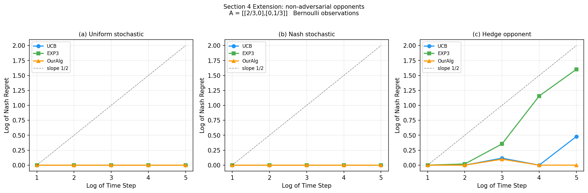
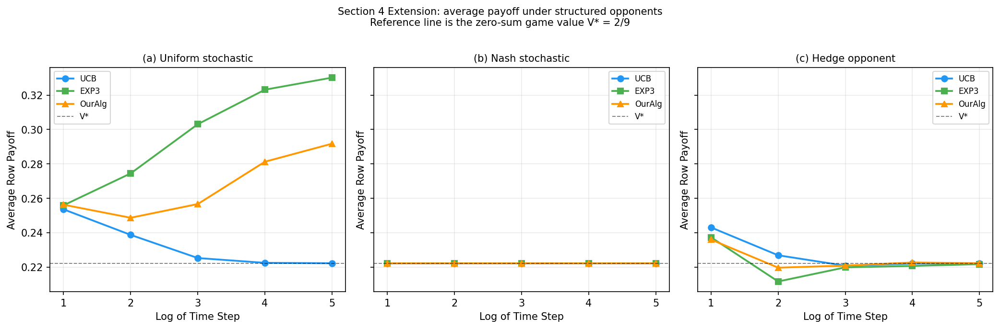

# Zero-Sum Matrix Games: Paper Reproduction

Reproduction of the experimental setup from *On the Limitations and Possibilities of Nash Regret Minimization in Zero-Sum Matrix Games under Noisy Feedback* (arXiv:2306.13233v3).

- Section 3 (full-information feedback): `Full_information_feedback/`
- Section 4 (bandit feedback, 2x2): `Bandit_feedback/`

---

# Full-information feedback (Section 3) reproduction

## Install

```bash
cd Full_information_feedback
pip install -r requirements.txt
```

## Setting

`n x n` diagonal matrix game with `A[i,i] = 0.4 + 0.2*(i-1)/(n-1)`. Each round the row player sees the **full noisy payoff row** (full-information feedback) and the column player always plays best-response. Plots show `log(total Nash regret)` vs `log(T)` for Our-Algo, Nash-empirical baseline, and Hedge, across `n = 10, 20, 50, 100`. The claim: Our-Algo achieves `polylog(T)` Nash regret while Hedge grows as `sqrt(T)`.

## Section 3 plots

The four plots below were generated with `Full_information_feedback/experiments_section3.py` using the `paper-lite` preset and the `official` variant for `n_actions = 10, 20, 50, 100`.

<table>
  <tr>
    <td width="50%"></td>
    <td width="50%"></td>
  </tr>
  <tr>
    <td align="center"><b>n = 10</b></td>
    <td align="center"><b>n = 20</b></td>
  </tr>
  <tr>
    <td width="50%"></td>
    <td width="50%"></td>
  </tr>
  <tr>
    <td align="center"><b>n = 50</b></td>
    <td align="center"><b>n = 100</b></td>
  </tr>
</table>

At `n=10`, Our-Algo grows much slower than Nash and Hedge. The same qualitative behavior holds at `n=20`, where the proposed method has a flatter regret curve than the baselines. At `n=50` and `n=100`, Our-Algo continues to outperform the baselines across horizons, although the gap shrinks as the matrix size grows.

## Empirical vs theoretical

On log-log axes, a `sqrt(T)` regret rate shows up as a straight line with slope `0.5`, while a `polylog(T)` rate appears as a curve that *flattens* toward slope `0` as `T` grows. The paper's theoretical rates for this setting are:

- **Our-Algo:** `polylog(T)` (with an extra dependence on `n`).
- **Hedge:** `O(sqrt(T log n))`, the standard online learning bound.
- **Nash (empirical):** `O(sqrt(T))`, a baseline that plays Nash of the empirical matrix.

The four plots above match this: Hedge and Nash trace approximately straight lines with slope near `0.5`, while Our-Algo's curve visibly flattens across horizons, consistent with the `polylog(T)` rate. The `n`-dependence predicted by the theory is also visible, since the gap between Our-Algo and the baselines shrinks as `n` grows from 10 to 100, though Our-Algo still stays clearly below `sqrt(T)` behavior.

---

# Bandit feedback (Section 4) reproduction

## Install

```bash
cd Bandit_feedback
pip install numpy matplotlib pandas jupyter
```

## Setting

2x2 diagonal matrix game `A = [[2/3, 0], [0, 1/3]]` with Nash equilibrium `x* = y* = (1/3, 2/3)` and value `V* = 2/9`. Each round the row player observes **only the Bernoulli-sampled entry `A[i_t, j_t]`** at the played cell (bandit feedback), not the full row. Every trial runs in two phases of length `T/2`: Phase 1 uses a phase-specific adversary, Phase 2 always uses pure best-response. Our-Algo (Algorithm 6) is compared against UCB and EXP3 against three column adversaries:

- **Adversary 1 (threshold BR):** plays pure best-response the moment `x1` deviates from `1/3`.
- **Adversary 2 (tolerance BR):** same as Adversary 1 but with a `±1/sqrt(T)` tolerance band around Nash before punishing.
- **Adversary 3 (Nash -> BR):** plays Nash `y* = (1/3, 2/3)` during Phase 1, then switches to pure best-response in Phase 2.

The plot shows `log(total Nash regret)` vs `log(T)` for each adversary. The claim: Our-Algo achieves `polylog(T)` Nash regret against **all three** adversaries.

## Figure 2 reproduction (paper Section 4.1)

The figure below was reproduced with `Bandit_feedback/section4_reproduction.ipynb`. The same experiment is also available in `Bandit_feedback/section4_bandit.py`.

Across all three adversaries, Our-Algo stays essentially flat while UCB and EXP3 grow polynomially, most dramatically against Adversary 3, matching the paper's core claim.


## Empirical vs theoretical

The paper's theoretical rates for the `2x2` bandit setting are:

- **Our-Algo (Algorithm 6):** `polylog(T)` Nash regret against any column adversary.
- **UCB and EXP3:** both are `Omega(sqrt(T))` in this adversarial regime. UCB fails because it is built for stochastic, not adversarial, columns; EXP3 fails because of the general lower bound in the paper's Theorem 3.

On log-log axes this means Our-Algo should have a slope that flattens toward `0`, while UCB and EXP3 should sit on straight lines with slope near `0.5`. Figure 2 matches this prediction: Our-Algo's curve is essentially flat against all three adversaries (most visibly against Adversary 3), while UCB and EXP3 grow at roughly `sqrt(T)` rate. The empirical results therefore align with the theoretical regret bounds claimed in Section 4.

---

# Extension: non-adversarial opponents (Section 4)

This extension keeps the same 2x2 bandit game and the same row-player algorithms (UCB, EXP3, and OurAlg), but replaces the adversarial column player with structured opponents:

- **Uniform stochastic opponent:** samples each column with probability `0.5`.
- **Nash stochastic opponent:** samples columns from `y* = (1/3, 2/3)`.
- **Hedge opponent:** uses a full-information Hedge update to learn which column gives the row player lower payoff.

The extension is isolated in:

- `Extensions/Bandit_Feedback_extension_non_adversarial/`

## Extension results

The plots below were generated with `Extensions/Bandit_Feedback_extension_non_adversarial/section4_extension_non_adversarial.ipynb` using the `paper-lite` preset.

## What the extension measures

The first plot keeps the paper's log-log Nash regret style, so it remains directly comparable to Figure 2. The second plot shows average row payoff over the horizon, which is useful because under non-adversarial opponents Nash regret alone does not tell the whole story.

Uniform and Nash stochastic opponents test whether simple non-adaptive behavior changes the need for an adversarially robust row algorithm. The Hedge opponent is an intermediate case: the column player learns from the row player, but it is still more structured than a pure best-response adversary.

<table>
  <tr>
    <td width="50%"></td>
    <td width="50%"></td>
  </tr>
  <tr>
    <td align="center"><b>Nash regret</b></td>
    <td align="center"><b>Average payoff</b></td>
  </tr>
</table>

The Nash-regret plot shows that all methods have essentially zero regret against the fixed Nash opponent, as expected. Against the Hedge opponent, EXP3 accumulates more regret than UCB and OurAlg, while OurAlg remains the most stable. Against the uniform opponent, regret is not very informative because the row player can get payoff above the game value.

The average-payoff plot makes the non-adversarial cases clearer. Under the Nash opponent, all algorithms stay at the game value `V* = 2/9`. Under the uniform opponent, EXP3 and OurAlg exploit the fixed column mixture and obtain payoff above `V*`. Under the Hedge opponent, payoffs stay close to `V*`, which indicates a more balanced interaction than the fixed uniform opponent but a less hostile one than pure best response.

---

# Extension: Noise Robustness

This extension varies the Gaussian feedback noise level `sigma` and compares how regret and average payoff change. Section 3 uses full-information Gaussian matrix feedback, while Section 4 uses Gaussian bandit feedback only at the played cell. The expectation is that Section 3 is more robust because the learner observes much more feedback each round, while Section 4 is more sensitive to noise.

In this extension, we replace the original Bernoulli feedback with Gaussian feedback noise, computed as `A + sigma * N(0,1)` and clipped to `[0,1]`, so that the noise level can be controlled explicitly.

The Section 3 extension is isolated in:

- `Extensions/Extension_Noise_Robustness_Full_info_feedback/`

The Section 4 extension is isolated in:

- `Extensions/Extension_Noise_Robustness_Bandit_feedback/`

## Noise robustness results

The Section 3 plots below were generated with `Extensions/Extension_Noise_Robustness_Full_info_feedback/section3_noise_robustness.ipynb` using the `medium` preset. The Section 4 plots were generated with `Extensions/Extension_Noise_Robustness_Bandit_feedback/section4_noise_robustness.ipynb` using the `paper-lite` preset.

<table>
  <tr>
    <td width="50%"></td>
    <td width="50%"></td>
  </tr>
  <tr>
    <td align="center"><b>Section 3: Nash regret vs noise</b></td>
    <td align="center"><b>Section 3: Average payoff vs noise</b></td>
  </tr>
</table>

For Section 3, increasing `sigma` mostly affects the baselines. The Nash baseline becomes noticeably worse as noise increases, especially for smaller games such as `n=10` and `n=20`. Hedge also degrades with noise, while Our-Algo remains comparatively stable across the tested noise levels.

The average-payoff plot shows the same pattern in a less amplified scale. Payoffs decrease mildly as noise increases, but they do not collapse. This supports the expected behavior: full-information feedback is relatively robust because the learner receives a complete noisy matrix signal each round.

<table>
  <tr>
    <td width="50%"></td>
    <td width="50%"></td>
  </tr>
  <tr>
    <td align="center"><b>Section 4: Nash regret vs noise</b></td>
    <td align="center"><b>Section 4: Average payoff vs noise</b></td>
  </tr>
</table>

For Section 4, the effect of noise is stronger. Against Adversaries 1 and 2, regret generally increases with `sigma`, especially for EXP3 and OurAlg. Against Adversary 3, UCB and EXP3 become much worse as noise increases, while OurAlg remains close to flat.

The average-payoff plot confirms that bandit feedback is more sensitive to noise. UCB and EXP3 lose payoff under high noise, most clearly against Adversary 3. OurAlg stays close to the game value `V* = 2/9`, which matches the paper's claim that the proposed bandit algorithm is more stable under difficult feedback conditions.
