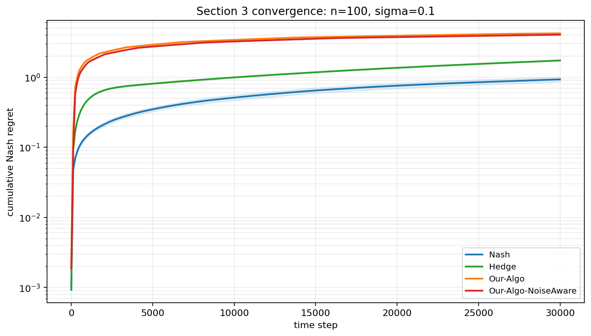
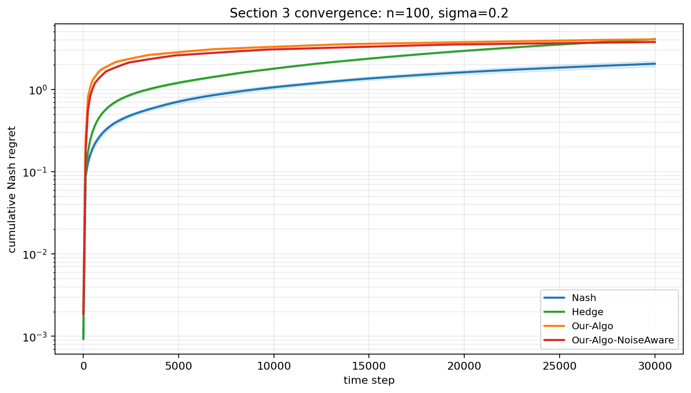
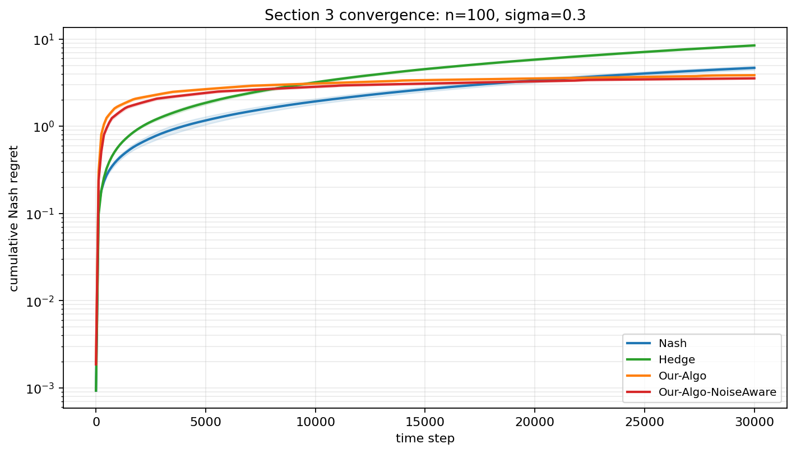
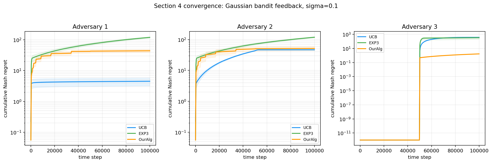
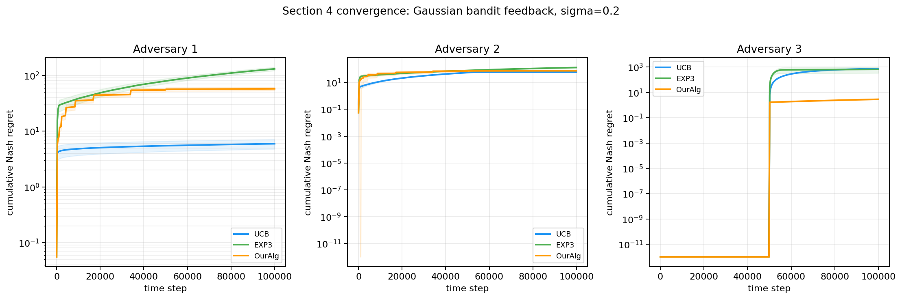
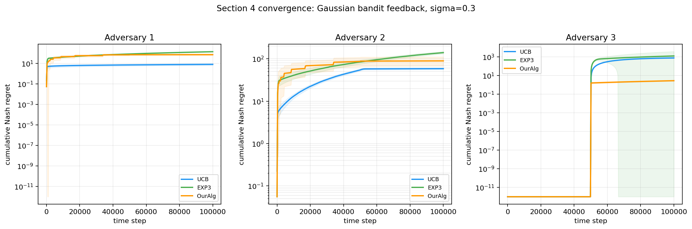

# Zero-Sum Matrix Games: Paper Reproduction

Reproduction of the experimental setup from *On the Limitations and Possibilities of Nash Regret Minimization in Zero-Sum Matrix Games under Noisy Feedback* (arXiv:2306.13233v3).

- Section 3 (full-information feedback): `Full_information_feedback/`
- Section 4 (bandit feedback, 2x2): `Bandit_feedback/`

---

# Full-information feedback (Section 3) reproduction

## Install

```bash
cd Full_information_feedback
pip install -r requirements.txt
```

## Setting

`n x n` diagonal matrix game with `A[i,i] = 0.4 + 0.2*(i-1)/(n-1)`. Each round the row player sees the **full noisy payoff row** (full-information feedback) and the column player always plays best-response. Plots show `log(total Nash regret)` vs `log(T)` for Our-Algo, Nash-empirical baseline, and Hedge, across `n = 10, 20, 50, 100`. The claim: Our-Algo achieves `polylog(T)` Nash regret while Hedge grows as `sqrt(T)`.

## Section 3 plots

The four plots below were generated with `Full_information_feedback/experiments_section3.py` using the `paper-lite` preset and the `official` variant for `n_actions = 10, 20, 50, 100`.

<table>
  <tr>
    <td width="50%"></td>
    <td width="50%"></td>
  </tr>
  <tr>
    <td align="center"><b>n = 10</b></td>
    <td align="center"><b>n = 20</b></td>
  </tr>
  <tr>
    <td width="50%"></td>
    <td width="50%"></td>
  </tr>
  <tr>
    <td align="center"><b>n = 50</b></td>
    <td align="center"><b>n = 100</b></td>
  </tr>
</table>

At `n=10`, Our-Algo grows much slower than Nash and Hedge. The same qualitative behavior holds at `n=20`, where the proposed method has a flatter regret curve than the baselines. At `n=50` and `n=100`, Our-Algo continues to outperform the baselines across horizons, although the gap shrinks as the matrix size grows.

## Empirical vs theoretical

On log-log axes, a `sqrt(T)` regret rate shows up as a straight line with slope `0.5`, while a `polylog(T)` rate appears as a curve that *flattens* toward slope `0` as `T` grows. The paper's theoretical rates for this setting are:

- **Our-Algo:** `polylog(T)` (with an extra dependence on `n`).
- **Hedge:** `O(sqrt(T log n))`, the standard online learning bound.
- **Nash (empirical):** `O(sqrt(T))`, a baseline that plays Nash of the empirical matrix.

The four plots above match this: Hedge and Nash trace approximately straight lines with slope near `0.5`, while Our-Algo's curve visibly flattens across horizons, consistent with the `polylog(T)` rate. The `n`-dependence predicted by the theory is also visible, since the gap between Our-Algo and the baselines shrinks as `n` grows from 10 to 100, though Our-Algo still stays clearly below `sqrt(T)` behavior.

---

# Bandit feedback (Section 4) reproduction

## Install

```bash
cd Bandit_feedback
pip install numpy matplotlib pandas jupyter
```

## Setting

2x2 diagonal matrix game `A = [[2/3, 0], [0, 1/3]]` with Nash equilibrium `x* = y* = (1/3, 2/3)` and value `V* = 2/9`. Each round the row player observes **only the Bernoulli-sampled entry `A[i_t, j_t]`** at the played cell (bandit feedback), not the full row. Every trial runs in two phases of length `T/2`: Phase 1 uses a phase-specific adversary, Phase 2 always uses pure best-response. Our-Algo (Algorithm 6) is compared against UCB and EXP3 against three column adversaries:

- **Adversary 1 (threshold BR):** plays pure best-response the moment `x1` deviates from `1/3`.
- **Adversary 2 (tolerance BR):** same as Adversary 1 but with a `±1/sqrt(T)` tolerance band around Nash before punishing.
- **Adversary 3 (Nash -> BR):** plays Nash `y* = (1/3, 2/3)` during Phase 1, then switches to pure best-response in Phase 2.

The plot shows `log(total Nash regret)` vs `log(T)` for each adversary. The claim: Our-Algo achieves `polylog(T)` Nash regret against **all three** adversaries.

## Figure 2 reproduction (paper Section 4.1)

The figure below was reproduced with `Bandit_feedback/section4_reproduction.ipynb`. The same experiment is also available in `Bandit_feedback/section4_bandit.py`.

Across all three adversaries, Our-Algo stays essentially flat while UCB and EXP3 grow polynomially, most dramatically against Adversary 3, matching the paper's core claim.


## Empirical vs theoretical

The paper's theoretical rates for the `2x2` bandit setting are:

- **Our-Algo (Algorithm 6):** `polylog(T)` Nash regret against any column adversary.
- **UCB and EXP3:** both are `Omega(sqrt(T))` in this adversarial regime. UCB fails because it is built for stochastic, not adversarial, columns; EXP3 fails because of the general lower bound in the paper's Theorem 3.

On log-log axes this means Our-Algo should have a slope that flattens toward `0`, while UCB and EXP3 should sit on straight lines with slope near `0.5`. Figure 2 matches this prediction: Our-Algo's curve is essentially flat against all three adversaries (most visibly against Adversary 3), while UCB and EXP3 grow at roughly `sqrt(T)` rate. The empirical results therefore align with the theoretical regret bounds claimed in Section 4.

---

# Extension: Noise Robustness

We inject **Gaussian noise** into the feedback (entries clipped to `[0, 1]`): `clip(A + sigma * N(0,1), 0, 1)`. Section 3 keeps **full-matrix** observations each round; Section 4 keeps **bandit** observations (noisy reward only at the played cell).

Code and notebooks:

- `Extensions/Extension_Noise_Robustness_Full_info_feedback/section3_noise_robustness.py` and `section3_noise_robustness.ipynb`
- `Extensions/Extension_Noise_Robustness_Bandit_feedback/section4_noise_robustness.py` and `section4_noise_robustness.ipynb`

Figures below use the **`medium`** preset (`T = 30_000` for Section 3 convergence; `T = 100_000` for Section 4 convergence), multi-sigma convergence runs at **`sigma` ∈ {0.1, 0.2, 0.3}**, and seed **`7`** (Section 3) / **`42`** (Section 4) unless you change them in the notebooks.

## Section 3 — noise-aware threshold (full information)

Baselines are unchanged. We add **Our-Algo-NoiseAware**, which waits longer before switching out of the exploration phase when feedback is noisier:

```python
threshold = min((1 + 2 * sigma) * log(T)**2, sqrt(T))
```

compared to the original `threshold = min(log(T)**2, sqrt(T))`.

### Summary at `sigma = 0.3` (noise sweep, `medium`)

| n | Nash regret | Hedge regret | Our-Algo regret | Our-Algo-NoiseAware regret | Reduction vs Our-Algo |
|---:|---:|---:|---:|---:|---:|
| 10 | 35.56 | 8.96 | 5.96 | 5.90 | 0.9% |
| 20 | 21.26 | 8.57 | 4.91 | 4.73 | 3.6% |
| 50 | 8.71 | 8.41 | 4.07 | 3.84 | 5.8% |
| 100 | 4.68 | 8.46 | 3.85 | 3.55 | 8.0% |

### Convergence (`n = 100`)

**Setup:** Each plot is **cumulative Nash regret** (log scale) vs time for Nash, Hedge, Our-Algo, and Our-Algo-NoiseAware under **diagonal full-information Gaussian noise** at noise standard deviation σ (**σ = 0.1**, then **0.2**, then **0.3** below). **Assumption:** curves are means over repeated runs (shaded bands).

<table>
  <tr>
    <td align="center"><b>σ = 0.1</b><br></td>
  </tr>
  <tr>
    <td align="center"><b>σ = 0.2</b><br></td>
  </tr>
  <tr>
    <td align="center"><b>σ = 0.3</b><br></td>
  </tr>
</table>

As σ increases, Nash and especially Hedge deteriorate because they rely on noisy empirical summaries without the paper’s exploration–commit schedule. Our-Algo and Our-Algo-NoiseAware stay closer at low σ (the noise-aware delay barely differs from the baseline); they separate at moderate σ (longer delay before trusting the empirical matrix reduces switching on sampling noise); at high σ, Our-Algo-NoiseAware finishes lowest—scaling the delay with σ avoids costly early updates and matches the strongest relative gains at **`n = 100`** in the table above.

## Section 4 — bandit noise (UCB, EXP3, OurAlg)

**Relationship to the Section 4 reproduction (Figure 2, earlier in this README):**

- **Same game:** the `2×2` matrix `A`, Nash value `V*`, and **two phases of `T/2` rounds** each (Phase 1: adversary-specific column play; Phase 2: **pure best-response** for every adversary type—so a **jump near `T / 2`** is structural, not an artifact of the extension).
- **Same three adversaries:** they are the **same column-player rules** as in **`Bandit_feedback/section4_bandit.py`**—implemented via the same **`advnew_batch` / `adv22gd_batch`** logic as the baseline runs (**Adversary 1** threshold best-response, **Adversary 2** tolerance band, **Adversary 3** fixed Nash mix \((1/3, 2/3)\) in Phase 1). The extension lives in `Extensions/Extension_Noise_Robustness_Bandit_feedback/` but **imports that module**; we do **not** introduce new opponents.
- **Only the observation model changes:** in the reproduction above, each round observes a **Bernoulli** outcome at the played cell (probability `A[i,j]`). Here we observe **`clip(A[i,j] + sigma * N(0,1), 0, 1)`** at the played cell (Gaussian noise, then clip). Because feedback is noisier and biased when clipped, **regret curves need not match Figure 2** in ordering or magnitude; differences are **expected** and do **not** contradict the noiseless experiment—they answer a different question (“what if bandit feedback is Gaussian-noisy?”).

We compare **UCB**, **EXP3**, and **OurAlg** only. With noisy observations, ranking across algorithms **varies with σ and adversary**; in our **`medium`** runs, **OurAlg** stays far below UCB/EXP3 **on Adversary 3** at high σ when UCB/EXP3 spike after the phase switch.

### Final Nash regret at `sigma = 0.3` (`medium`, seed 42)

| Adversary | UCB regret | EXP3 regret | OurAlg regret |
|---:|---:|---:|---:|
| 1 | 8.27 | 142.42 | 73.58 |
| 2 | 58.50 | 139.81 | 89.23 |
| 3 | 773.81 | 1265.62 | 2.81 |

### Convergence

**Plot setup:** Each figure has **three panels** (Adversaries 1–3): **UCB** (blue), **EXP3** (green), **OurAlg** (orange)—same adversary index as in Figure 2 and `section4_bandit.py`. Three stacked plots below sweep **σ = 0.1**, then **0.2**, then **0.3**. **Assumption:** Gaussian noise only on the **observed** cell reward (then clip); regret is cumulative Nash regret vs the game value `V*` (same target as the baseline code).

<table>
  <tr>
    <td align="center"><b>σ = 0.1</b><br></td>
  </tr>
  <tr>
    <td align="center"><b>σ = 0.2</b><br></td>
  </tr>
  <tr>
    <td align="center"><b>σ = 0.3</b><br></td>
  </tr>
</table>

At **low σ**, curves are relatively smooth and algorithm ranking **depends on the adversary**—noise is mild enough that UCB can still be competitive where its exploration matches the phase schedule; differences are mostly **adversary-driven**. As σ rises to **moderate**, cumulative regret moves up and spreads across methods because optimistic indices and sampling interact with **noisy cell observations**, so mistakes linger in UCB/EXP3’s statistics. At **high σ**, especially on **Adversary 3**, UCB and EXP3 blow up after the phase switch while **OurAlg** stays comparatively flat: Phase 1 is easy there, but after **`T / 2`** the column becomes harsh—generic bandit rules **mis-track** that shift under heavy observation noise, whereas OurAlg’s update matches the paper’s adversarial bandit construction and keeps regret growth far smaller.

## Extension conclusion

- **Section 3:** A noise-aware **exploration delay** improves Our-Algo under noisy full-information feedback, especially at larger `n` (see ~8% regret reduction at `n = 100`, `sigma = 0.3`).
- **Section 4:** Same **`section4_bandit`** adversaries and two-phase protocol as the reproduction; only **Gaussian noisy** bandit observations instead of Bernoulli. We report **UCB**, **EXP3**, and **OurAlg** across **σ** with convergence curves per adversary.
